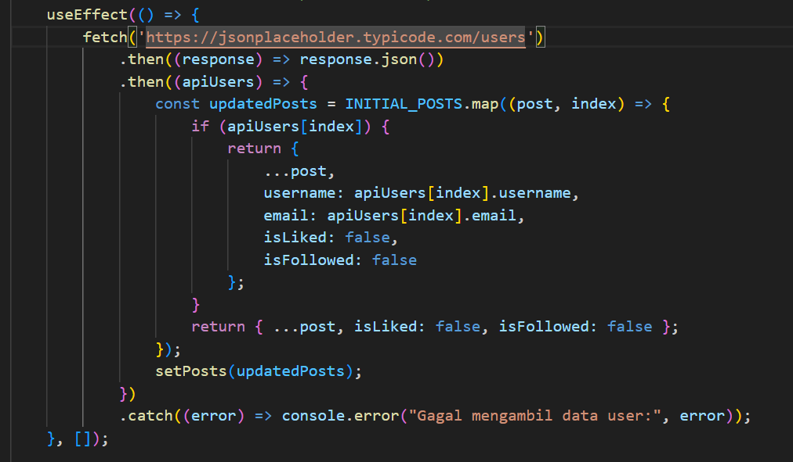

# Antagram - Aplikasi Social Media Sederhana

**Tugas Akhir Semester Kelas 11 RPL - SMK Letris Indonesia 2**
**Program Studi: Rekayasa Perangkat Lunak dan Gim**
**Semester: Ganjil Tahun Akademik 2025/2026**

---

## Deskripsi Aplikasi

Antagram adalah aplikasi web social media sederhana yang dibangun menggunakan **React JS**. Aplikasi ini menampilkan feed dari berbagai user, memungkinkan pengguna untuk like, follow, dan mencari user lain.

---

## Fitur Utama

- **Login & Signup** - Autentikasi sederhana dengan localStorage
- **Home Feed** - Menampilkan posts dari berbagai user
- **Search User** - Mencari user berdasarkan username
- **Like Feature** - Like dan unlike posts
- **Follow Feature** - Follow dan unfollow user
- **Modern UI** - Interface yang menarik dan user-friendly

---

## Fetch API - Pengambilan Data dari Server

### Endpoint API yang Digunakan
- **URL**: `https://jsonplaceholder.typicode.com/users`
- **Method**: GET
- **Response**: Array of user objects

### Implementasi di UserContext.jsx

<details>
  <summary>Klik di sini untuk melihat Screenshot</summary>
  <br />
  
</details>

**Penjelasan:**
- Fetch data user dari API saat component mount (dependency array kosong)
- Merge data API dengan INITIAL_POSTS untuk membuat posts yang lebih lengkap
- Data disimpan ke state `posts`
- Error handling dengan `.catch()` untuk menangani kegagalan request

---

## Implementasi React Hooks

### 1. **useState** - Mengelola State Lokal dan Global

**Di UserContext.jsx:**
<details>
<summary>Klik di sini untuk melihat Kode</summary>

```jsx
const [searchQuery, setSearchQuery] = useState("");
const [user, setUser] = useState(null);
const [posts, setPosts] = useState(INITIAL_POSTS);
const [activePage, setActivePage] = useState("home");
```
</details>

**Fungsi:**
- `searchQuery` - Menyimpan input pencarian
- `user` - Menyimpan data user yang login
- `posts` - Menyimpan semua posts
- `activePage` - Menyimpan halaman aktif (home/find)

**Di Search.jsx:**
<details>
<summary>Klik di sini untuk melihat Kode</summary>

```jsx
const [email, setEmail] = useState('');
const [user, setUser] = useState('');
const [password, setPassword] = useState('');
```
</details>

### 2. **useEffect** - Menjalankan Side Effects

**Fetch data dari API:**
<details>
<summary>Klik di sini untuk melihat Kode</summary>

```jsx
useEffect(() => {
    fetch('https://jsonplaceholder.typicode.com/users')
        .then((response) => response.json())
        .then((apiUsers) => {
            // Update posts dengan data dari API
            setPosts(updatedPosts);
        })
        .catch((error) => console.error("Error:", error));
}, []); // Empty dependency array = run once on mount
```
</details>

**Check localStorage saat app start:**
<details>
<summary>Klik di sini untuk melihat Kode</summary>

```jsx
useEffect(() => {
    const loggedInUser = localStorage.getItem("user");
    if (loggedInUser) {
        setUser(loggedInUser);
    }
}, []);
```
</details>

### 3. **useContext** - Mengakses Global State

**Di Menu.jsx:**
<details>
<summary>Klik di sini untuk melihat Kode</summary>

```jsx
const { activePage, setActivePage } = useContext(UserContext);

// Gunakan untuk update page saat klik menu
onClick={() => setActivePage("find")}
```
</details>

**Di Content.jsx:**
<details>
<summary>Klik di sini untuk melihat Kode</summary>

```jsx
const { handleLike, handleFollow } = useContext(UserContext);

// Gunakan untuk trigger like/follow
onClick={() => handleLike(post.id)}
```
</details>

**Di Search.jsx:**
<details>
<summary>Klik di sini untuk melihat Kode</summary>

```jsx
const { posts, searchQuery, setSearchQuery } = useContext(UserContext);

// Gunakan untuk filter dan update search query
```
</details>

---

### 4. **useRef** - 

Contoh penggunaan:

<details>
<summary>Klik di sini untuk melihat Kode</summary>

```jsx
const searchInputRef = useRef(null);

useEffect(() => {
    const timer = setTimeout(() => {
        if (searchInputRef.current) {
            searchInputRef.current.focus();
        }
    }, 100);

    return () => clearTimeout(timer);
}, []);

<input
    ref={searchInputRef} 
    type="text"
    placeholder="Ketik username..."
    value={searchQuery || ""}
    onChange={(e) => setSearchQuery && setSearchQuery(e.target.value)}
    className="search-box-input"
/>
```
</details>


---

## Interaktivitas Website

### 1. Like Feature
- Klik tombol "Like" untuk like post
- Button berubah warna menjadi "❤️ Liked" saat di-like
- Data tersimpan di state `isLiked`

<details>
<summary>Klik di sini untuk melihat Kode</summary>

```jsx
const handleLike = (id) => {
    setPosts(prevPosts => 
        prevPosts.map(post => 
            post.id === id ? { ...post, isLiked: !post.isLiked } : post
        )
    );
};
```
</details>

### 2. Follow Feature
- Klik tombol "Follow" untuk follow user
- Button berubah menjadi "Following" saat sudah follow
- Data tersimpan di state `isFollowed`

### 3. Search Feature
- Ketik di input search untuk filter user
- Real-time filtering berdasarkan username
- Menampilkan hasil pencarian di halaman Find

---

## Context API Structure

**UserContext.jsx** menyediakan global state:
<details>
<summary>Klik di sini untuk melihat Kode</summary>

```jsx
<UserContext.Provider value={{
    user,           // Username yang login
    setUser,        // Function untuk set user
    posts,          // Array of posts
    handleLike,     // Function untuk like post
    handleFollow,   // Function untuk follow user
    searchQuery,    // Query pencarian
    setSearchQuery, // Function untuk update search query
    activePage,     // Halaman aktif saat ini
    setActivePage   // Function untuk switch halaman
}}>
    {children}
</UserContext.Provider>
```
</details>

**Component yang menggunakan Context:**
- Menu.jsx - Mengakses `activePage`, `setActivePage`
- MainPage.jsx - Mengakses `posts`, `activePage`
- Search.jsx - Mengakses `posts`, `searchQuery`, `setSearchQuery`
- Content.jsx - Mengakses `handleLike`, `handleFollow`

---

## 🔗 Links Penting

- **GitHub Repository**: https://github.com/028-shadow-dev/Clone-Sosmed.git
- **Live Demo**: https://sosmed-clone.vercel.app/
- **API Documentation**: https://jsonplaceholder.typicode.com

---

## 📋 Catatan Pengembang

- Aplikasi menggunakan localStorage untuk autentikasi sederhana (tidak aman untuk production)
- Aplikasi menggunakan localStorage jadi setiap akun user bisa bebas bikin

